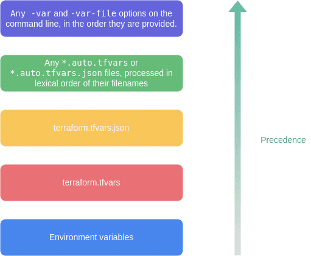

# Terraform Cheat Sheet

### Destroy Specific Resources

    terraform plan -destroy -target="module.<submodule>.<resourcetype>.<resourcename>"

    terraform destroy -target="module.<submodule>.<resourcetype>.<resourcename>"

### Import State of Resources

Resource Import

    terraform import aws_iam_role.role_name my_role

Module Import

    terraform import module.iam.aws_iam_user.user bill

Module Import for_each

    terraform import module.iam.aws_iam_user.user[\"bill\"] bill    

### Remove State of Resources

States created in a module with a for each loop

    tf state rm 'module.peering.azurerm_virtual_network_peering.peer_vns["peering-name"]'

### Forcing Re-creation of Resources

    terraform apply -replace="aws_instance.example"

### Define Variables

#### CLI

    terraform plan -var-file=”prod.tfvars”

    terraform plan -var="instance_type=t2.large"

    TF_VAR_instance_type="t2.small" terraform plan

#### Variable Loading Precedence
An interesting thing to ponder is the precedence of the various methods of providing variable values.
Variable loading precedence (von unten nach oben, spätere überschreiben frühere):

## Links

https://www.hashicorp.com/blog/terraform-azurerm-provider-4-0-adds-provider-defined-functions
  
https://medium.com/azure-terraformer/terraform-input-templating-with-the-templatestring-function-a81583777ed1 
